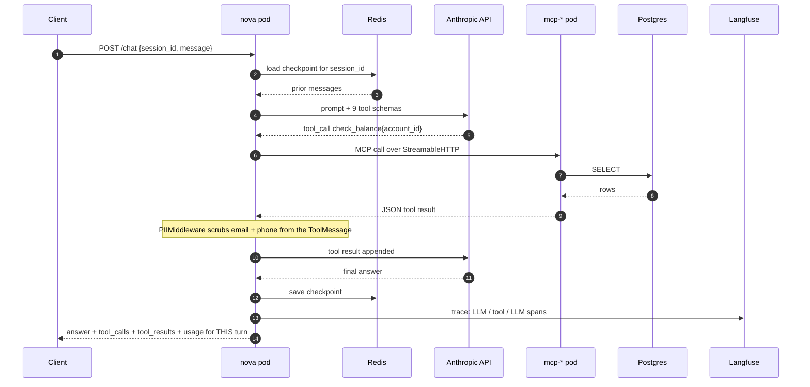
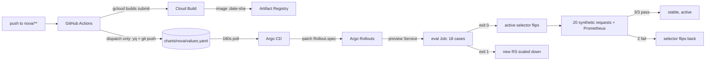

# Nova on GKE: architecture

What is **actually deployed**, as of **2026-09-17**. Nothing on this page is aspirational: if
it's drawn or listed, it's running in the cluster and has been exercised. What is not built is
named in §7 so the diagrams cannot overstate the system.

- GCP project `mlops-lifecycle-p7-gke`, region `us-west1`, zone `us-west1-b`
- GKE **zonal** cluster `mlops-lifecycle`, VPC-native, private nodes, **no GPU**
- Node pool `primary`, 2 × `e2-standard-4`, **scaled to 0 between sessions**
- Application resources in namespace `nova`; controllers in `argocd`, `argo-rollouts`,
  `monitoring`, `external-secrets`

Diagrams are generated from source, not hand-drawn. The script in `docs/diagrams/` is the
source of truth and is read off `terraform-gcp/*.tf` and `charts/nova/templates/*.yaml`:

```bash
brew install graphviz            # once: provides the `dot` engine
pip3 install diagrams            # once: mingrammer/diagrams, official GCP + k8s icons
python3 docs/diagrams/nova-gke.py
```

---

## 1. The runtime


Source: [`diagrams/nova-gke.py`](diagrams/nova-gke.py)

A **runtime** diagram: it follows one customer question through the system, numbered 1 to 9.
The delivery plane (CI, Argo CD, Argo Rollouts, the eval Job) is deliberately absent here and
drawn separately in §5, because it changes the system rather than taking part in an
interaction. Dotted edges are standing background: credentials the pods already hold,
refreshed hourly, not fetched per request.

Laid out as **trust zones** (internet, public edge, your private VPC, Google-managed APIs)
rather than the public/private subnet lanes an AWS diagram would use. GCP has no such subnet
concept; §2 is why, and it is worth being able to say out loud.

Four things to take away:

- **Nova is ClusterIP only.** No Ingress, no LoadBalancer. With no front door, a request
  reaches the pod through a `kubectl port-forward` tunnel via the API server.
- **Cloud NAT is the only egress path**, because private nodes have no external IP. Anthropic
  and Langfuse leave through it; Secret Manager does *not*, that is Private Google Access. Two
  different paths that fail with the same symptom, a hang, for different destinations.
- **No static credential exists on the secrets path.** ESO's Kubernetes SA is annotated to a
  GCP service account and the metadata server issues short-lived tokens. `secretAccessor` is
  granted **per secret**, not project-wide.
- **Langfuse is dashed on purpose.** Its Secret refs are `optional: true`, so missing keys
  start Nova **untraced** rather than stuck in `CreateContainerConfigError`. Tracing must not
  be able to take down the thing it traces.

---

## 2. "Where are the public and private subnets?"

The first thing an AWS-shaped eye looks for, and it is genuinely absent. GCP does not model
public vs private at the subnet level, so the diagram uses **trust zones** instead, which is
what the AWS subnet split is really communicating.

| AWS mental model | GCP reality | Consequence for the diagram |
|---|---|---|
| Subnet is public or private, decided by its **route table** (IGW route or not) | A GCP subnet has **no public/private flag**. Every VPC carries an implicit `0.0.0.0/0 → default-internet-gateway` route on every subnet | There are no lanes to draw |
| Privacy comes from which subnet you land in | Privacy comes from the instance having **no external IP** (`enable_private_nodes = true`) plus firewall rules. Two nodes in one subnet can differ | "Private" is a property of the node pool, so it's labelled there |
| NAT Gateway is an appliance placed **in a public subnet**, per AZ | Cloud NAT is a **regional, software-defined** service on a Cloud Router. It occupies no subnet and has no instance | Drawn at the public edge, not inside the VPC box |
| Subnets are **AZ-scoped**, so diagrams get AZ columns | Subnets are **regional**. This is a zonal cluster, so nodes sit in `us-west1-b`, but the subnet spans `us-west1` | No AZ columns; the zone is on the node pool label |
| Security groups attach to instances | Firewall rules are **VPC-level**, targeted by network **tag** or **service account**. No NACL equivalent; rule priority does that job | The IAP-SSH rule targets a tag, not a box |
| ALB in the public subnet, targets private | This cluster has **no Ingress and no LoadBalancer** | The public-edge zone is deliberately near-empty |

**So what is actually public here?** Exactly two things:

1. The **GKE control-plane endpoint**: public, but `master_authorized_networks` narrows it to
   a single /32. It also lives in a Google-managed VPC (`172.16.0.0/28`) peered to yours, not
   in your subnet at all.
2. **Cloud NAT's auto-allocated egress IPs**: outbound only. Nothing can dial in through them.

There is no inbound public data path. Nova is ClusterIP; the front door is `kubectl
port-forward`. If this ever needs a real one, the GCP shape is a GKE Ingress or Gateway
provisioning a Google Cloud Load Balancer that targets **pod IPs directly through NEGs**:
container-native load balancing, which is what VPC-native mode buys and what skips the
`nodeport → kube-proxy → other-node` double hop.

---

## 3. One question, end to end

Kept as a sequence diagram; graphviz draws topology well and message ordering badly.



Two things this is meant to make obvious:

- **The loop can repeat.** `NOVA_RECURSION_LIMIT=15` ≈ 7 tool rounds. That cap is the
  per-request cost ceiling, not a correctness setting.
- **Only the current turn is reported.** `result["messages"]` is the whole thread; slicing per
  turn is what lets a cost gate tell a wasteful agent from a long conversation.

### The write path is different

When the model chooses `initiate_transfer`, `HumanInTheLoopMiddleware` interrupts **between
step 5 and step 6**. The graph checkpoints to Redis and `/chat` returns `pending_approval`
instead of an answer. Nothing has executed. A later `POST /approve {session_id, decision}`
resumes from that checkpoint: on `approve` the tool runs and steps 6 to 15 complete; on
`reject` the model is told and answers the customer. A second `/approve` is refused. The
`session_id` is the resume token because it is already the checkpointer's `thread_id`.

---

## 4. Every connection, and why

| From | To | How | Why it's shaped this way |
|---|---|---|---|
| Laptop | Control plane | HTTPS :443 | Endpoint is public but `master_authorized_networks` is one /32. No bastion, no 0.0.0.0/0. That IP is residential and rotates; a `kubectl` hang with `i/o timeout` is this. |
| Nodes | Artifact Registry | Private Google Access | Private nodes have no external IP; Google APIs traverse Google's network, not the NAT. |
| Nodes | Docker Hub, PyPI, Anthropic, Langfuse, GitHub | Cloud NAT | The only route to the public internet. |
| ESO pod | Secret Manager | Workload Identity | KSA → GSA, short-lived tokens. No JSON key exists to leak or rotate. |
| ESO | K8s Secrets | ExternalSecret, 1h refresh | The *reference* is in git, the value never is. Rotation still needs a rollout; Postgres reads its password once at startup. |
| Nova | mcp-* | MCP StreamableHTTP :8080 | Three Deployments off one image, different entrypoints. Separate connectors = separate blast radius and separate tool schemas. |
| mcp-* | Postgres | SQL :5432, headless svc DNS | Connectors own data access; Nova never speaks SQL. |
| Nova | Redis | LangGraph checkpointer :6379 | `redis-stack-server`, not `redis:7-alpine`; the checkpointer needs RediSearch. Also holds paused HITL state, so a pod restart mid-approval loses nothing. |
| Nova | Anthropic | HTTPS via NAT | The only inference dependency. No GPU by design. |
| Prometheus | Nova `/metrics` | scrape, ServiceMonitor | Selects on the Service's `app: nova` label. The preview Service deliberately lacks it, so a candidate's metrics never blend into the live series the gate queries. |
| Argo CD repo-server | GitHub | HTTPS via NAT, 180s poll | The only component that touches git. Renders `charts/nova` with `helm template`; never touches the Kubernetes API. |
| Argo CD application-controller | API server | in-cluster | The only Argo CD component that writes to the cluster. Diffs rendered YAML against live state and patches the difference. |
| Argo Rollouts controller | API server | in-cluster, watch | Watches `Rollout` objects cluster-wide. Reacts to the spec Argo CD wrote; the two never talk directly. |
| Argo Rollouts | Prometheus | PromQL, post-promotion | Error rate and p95 over the last 2m, three samples each. |
| Argo Rollouts | eval Job | Kubernetes Job, pre-promotion | Exit code is the verdict. Runs against `nova-preview`, which has no traffic. |
| GitHub Actions | Cloud Build | `gcloud builds submit` | Native amd64 build; no local daemon, no cross-arch `exec format error`. |
| GitHub Actions | GitHub | `git push` of `charts/nova/values.yaml` | **This is the deploy.** CI holds no cluster credential; it writes a tag and Argo CD does the rest. |

---

## 5. The delivery plane

Not in the runtime diagram because it changes the system rather than participating in a
request. Every arrow here has run for real.



Three properties, each provable from the rollout history:

- **Build and deploy are separate triggers.** A push builds and stops. Only a manual dispatch
  commits the tag, because the tag commit starts both gates (~$0.27 in tokens). Tags are
  derived from the commit, so a dispatch reuses the image the push already built: build once,
  deploy that artifact.
- **CI never holds a cluster credential.** It has a GCP service account for Cloud Build and
  Artifact Registry, and `contents: write` on the repo. Nothing that can reach the API server.
- **All three outcomes have been exercised.** Revision 3 failed pre-promotion and never took
  traffic. Revision 2 failed post-promotion and was switched back with nobody watching.
  Revisions 4, 6 and 7 promoted cleanly.

Two things the gates found in things we built, not in Nova:

1. **The error-rate query aborted a perfect deploy.** `sum()` over an absent counter series is
   empty, not zero, and a labelled counter does not exist until its first increment. With zero
   errors there was no `{status!="ok"}` series to sum. Fixed with `or vector(0)`.
2. **Faithfulness caught tools returning amounts with no currency.** The agent wrote "AED" from
   context; the judge marked it unsupported. Five of nine tools had the gap. Fixed in the tools,
   not the judge, because loosening the judge would teach it to tolerate the exact claim it
   exists to catch.

---

## 6. Deliberate choices worth defending

| Choice | Instead of | Why here | What it costs |
|---|---|---|---|
| Zonal cluster | Regional | One control plane; the shape the GKE free tier covers | No zone-failure survival |
| In-cluster Postgres StatefulSet | Cloud SQL | Cheaper, and a real StatefulSet to operate | Manual backups, no IAM DB auth |
| In-cluster Redis, 1 replica | Memorystore / Sentinel | Cost | No HA; a restart replays AOF, it does not fail over |
| Private nodes + restricted public endpoint | Private endpoint + bastion | `kubectl` works with no tunnel | CIS GKE Benchmark wants the private endpoint |
| Dedicated node SA | Compute Engine default SA | The default holds project **Editor**, inherited by any pod that reaches the metadata server | One more Terraform resource |
| `random_password` → Secret Manager | Value injected out-of-band | `terraform apply` alone leaves a working system | Plaintext in HCP state, twice |
| ClusterIP everywhere, no Ingress | LoadBalancer / Ingress | Nothing needs to be internet-facing | No public demo URL |
| Helm chart for the app manifests | Kustomize | Helm was already in the stack (ESO, kube-prometheus-stack, Argo CD); Kustomize would be a fourth way to render YAML | Chart is deliberately thin: only image refs templated |
| Argo CD (pull) | CI applies manifests (push) | CI needs no cluster credential; git is the deploy record | One more controller; a 180s poll instead of a webhook |
| Argo Rollouts | Flagger | Flagger is Flux-native and needs a service mesh for traffic splitting; Rollouts does blue-green without one and pairs with the Argo CD already installed | A new CRD and controller; `Deployment` became `Rollout` |
| `job` provider for pre-promotion | `prometheus` provider | The eval is a replay of a fixed dataset, not a measurement of traffic. Its exit code is the signal; Prometheus never needs to see it | Pushgateway and score-trend dashboards are not on the gate path |
| PII redaction on tool results | on user input | The PII arrives *from* `get_customer`. Redacting input would strip `ACC-00004` before the agent could use it and break every case | Nothing scrubs what the customer types beyond the defaults |
| Human approval as a second HTTP call | inline confirmation | Nova has no UI; `session_id` is already the checkpointer's `thread_id`, so no token store is needed | A client retrying `/chat` on a paused session corrupts it |
| Long-lived SA key for CI | Workload Identity Federation | Speed. Documented in `terraform-gcp/cicd.tf` with the migration path | A credential that never expires, rotated by hand |
| No `EvaluationRun` CRD | kopf controller | The eval is a one-shot Job; CI and Rollouts already consume its exit code. A controller reconciles ongoing state, and there is none | The interview answer is the rejection, not an artifact |

---

## 7. Not built

Named so the diagrams cannot overstate the system.

| Missing | What stands in today |
|---|---|
| Drift monitoring: Pushgateway, nightly `CronJob`, `PrometheusRule` on score thresholds | Nothing runs unless a deploy triggers the gate. Everything it needs exists; ~2h. |
| MLflow registry, distilled router classifier | Nothing. No model is trained in this project; the agent calls Claude over an API. A registry with nothing to register would be theatre. |
| Regression set | An empty file until drift monitoring produces its first failure. |
| Cost gate on the rollout | `run_eval.py` supports a per-request budget; the Rollout's `AnalysisTemplate` does not read it yet. |
| `full_name` redaction | Email and phone only. No regex finds arbitrary names; that needs NER. |

---

## 8. Cost and teardown

Node pool ~$0.29 to 0.38/hr. Cloud NAT ~$0.05/hr. PVCs and Artifact Registry in cents. Each
deploy ~$0.27 in tokens for both gates. Between sessions the pool goes to zero rather than the
cluster being destroyed; the cluster, controllers, PVCs and seeded data all survive at ~$1/month:

```bash
gcloud container clusters resize mlops-lifecycle --node-pool=primary --num-nodes=0 \
  --zone=us-west1-b --project=mlops-lifecycle-p7-gke --quiet
```

Teardown of last resort, which also removes the NAT:
`gcloud projects delete mlops-lifecycle-p7-gke`.
